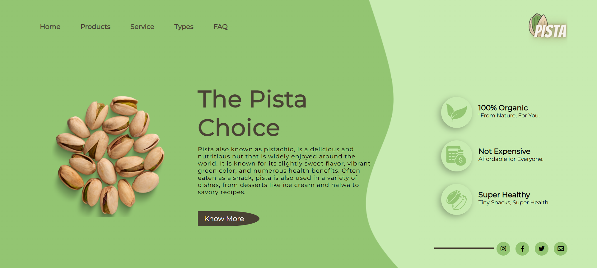

# Landing Page - The-Pista-Choice
- A Fresh, Responsive Landing Page dedicated to Promoting Organic Pistachios. This Design combines Clean UI Elements, Natural Green tones and healthy lifestyle messaging to Create a Visually appealing Product Showcase.  
- The Site is built using fundamental Web Technologies, Ensuring a Fast and Lightweight Experience for Visitors & 
  this Website is a Single-Page Application that provides a Professional Overview of my Work and a Clear way for Potential Employers or Collaborators to Get in touch.

## Features

- Hero Section with product image and engaging intro text

- Smooth color gradients and shadows for visual appeal

- Circular nut image gives a natural, fresh appeal

- Clean split layout with text on left and benefits on right

- Modern green-themed color palette reflecting organic branding

## Tech Stack

- HTML5 – Markup structure

- CSS3 – Styling and layout

## Screenshots

Below is a Preview of **Landing Page - The Pista Choice**, Showcasing the Layout and Styling implemented Using pure HTML and CSS. 
The Design focuses on Clean Structure, Responsiveness and Modern Styling.

